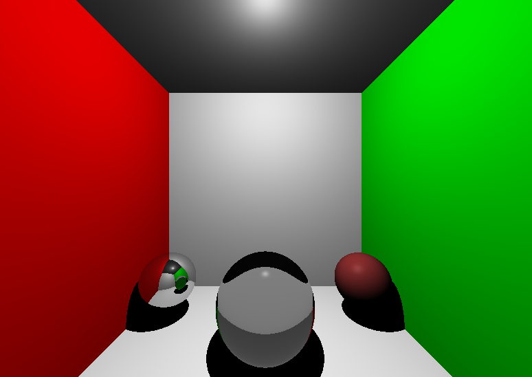
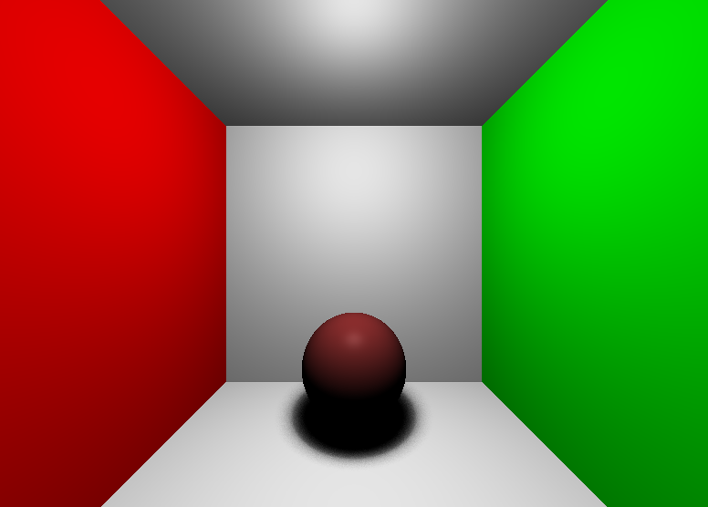
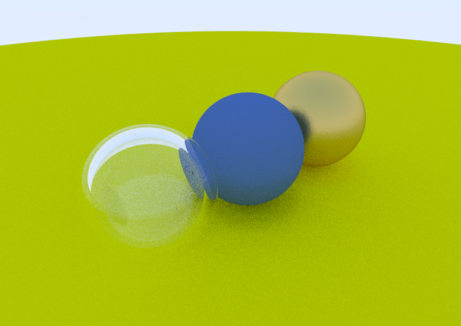
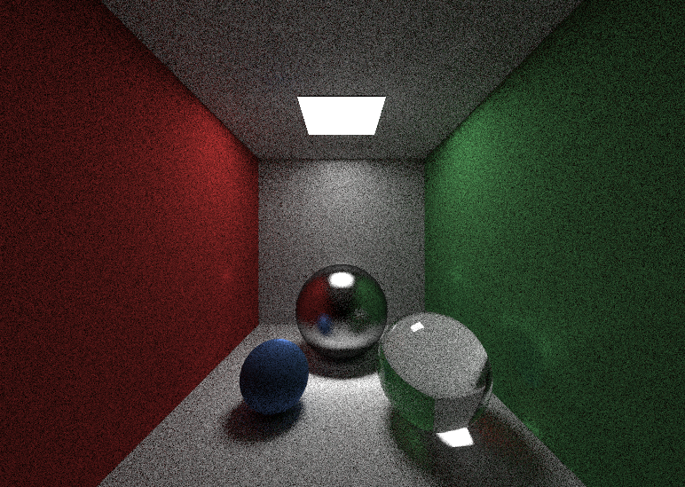

# Примеры программной трассировки лучей на C++ (CPU)
Данный репозиторий планировался как набор примеров программной трассировки лучей, для наглядной демонстрации различных техник и алгоритмов

Репозиторий будет со временем (возможно) поплняться другими примерами

Пример реализации отражений, преломлений, простых теней (освещение по Фонгу)

1) Основа. Пример реализации отражений, преломлений, простых теней (освещение по Фонгу)

   
   
2) Мягкие тени.

   
   
3) Базовый трассировщик путей (path tracing)

   
   
4) Источники света и непрямое освещение (path tracing)
   
   

Код писался и тестировался при помощи следующего набора инструментов
 - CLion (IDE)
 - MinGW или MSVC (Компиляция и сборка)

Вы можете открыть данный проект при помощи IDE с поддержкой CMake (CLion, Visual Studio 2019) и собрать его, 
либо сгенерировать файлы проекта для подходящей IDE (данный вариант не проверялся).

